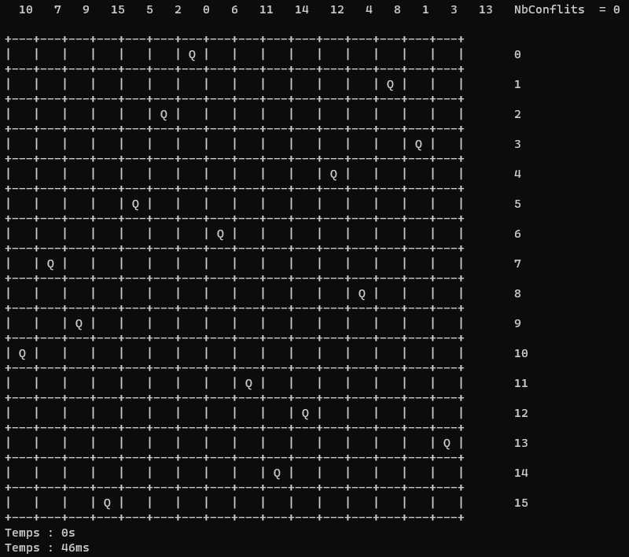

# Problème des N Reines avec algorithme génétique et MPI


Ce projet a pour objectif de résoudre le problème classique des N reines en utilisant un algorithme génétique implémenté en C++ avec la bibliothèque MPI pour la distribution parallèle. Le problème des N reines consiste à placer N reines sur un échiquier de N x N de manière à ce qu'aucune reine ne puisse menacer une autre reine en une seule étape de mouvement. L'algorithme génétique sera utilisé pour trouver une disposition optimale des reines. (https://en.wikipedia.org/wiki/Eight_queens_puzzle)

## Fonctionnalités clés

- **Représentation génétique :** Les individus de la population seront représentés sous forme de séquences génétiques correspondant aux positions des reines.
- **Opérations génétiques :** L'algorithme génétique mettra en œuvre des opérations telles que la sélection, le croisement et la mutation pour évoluer la population vers une solution optimale.
- **Fonction d'évaluation :** Une fonction d'évaluation sera définie pour évaluer la qualité de chaque disposition de reines.
- **Distribution MPI :** L'utilisation de la bibliothèque MPI permettra de distribuer les calculs entre différents processus parallèles.
- **Communication en anneaux :** Chaque processus communiquera avec ses voisins pour échanger les meilleurs individus de chaque population.


## Prérequis

Assurez-vous d'avoir les éléments suivants installés :

- Compilateur C++
- Bibliothèque MPI

## Installation

Dans les paramètres du projet :

- C/C++ > Général > Autres répertoires include : Ajouter le chemin vers le dossier include de la bibliothèque MPI

- Éditeur de liens > Général > Répertoires de bibliothèques supplémentaires : Ajouter le chemin vers le dossier lib de la bibliothèque MPI

- Éditeur de liens > Entrée > Dépendances supplémentaires : Ajouter les librairies msmpi.lib

## Utilisation

Pour lancer le programme, exécutez la commande suivante dans un terminal :

```bash
mpiexec -n <nombre de processus> <chemin vers l'exécutable>
```

- Remplacez `<nombre de processus>` par le nombre de processus MPI à utiliser

- Remplacez `<chemin vers l'exécutable>` par le chemin vers l'exécutable du programme

---

Avec N = 4 :

12 reines : <br />

<br />

16 reines : <br />

<br />

20 reines : <br />

